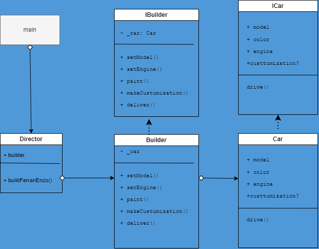

# Builder Design Pattern with TypeScript

This project demonstrates the Builder design pattern implemented in TypeScript. It includes the following files:

- `Builder.ts`: Defines the `Builder` class that constructs a `Car` step by step.
- `Car.ts`: Defines the `Car` class, which represents the product to be constructed.
- `Director.ts`: Defines the `Director` class, responsible for orchestrating the construction of a car.
- `IBuilder.ts`: Defines the `IBuilder` interface for building parts of the `Car`.
- `ICar.ts`: Defines the `ICar` interface, representing the structure of a car.
- `main.ts`: The main entry point that demonstrates the use of the Builder pattern.

## Installation

Before running the project, make sure you have Node.js and TypeScript installed. You can install TypeScript globally using the following command:

```bash
npm install -g typescript
```


1. Clone the project
2. Install and then build the project

```bash
npm install
npm run build
```

## Usage
To run the project and see the Builder design pattern in action, use the following command:

```bash
npm run go
```

This will build and execute the TypeScript code, creating two different cars (F430 and Enzo) and demonstrating how the Builder pattern works.

**UML Diagram**
You can find a UML class diagram (uml.png) in the project directory. This diagram illustrates the associations and relationships between the classes in the Builder pattern.



**Structure**
- src/: Contains the TypeScript source files.
- dist/: Will contain the compiled JavaScript files.

**Sources**
- refactoring.guru: https://refactoring.guru/design-patterns/builder/typescript/example
- sbcode: https://sbcode.net/typescript/builder/


